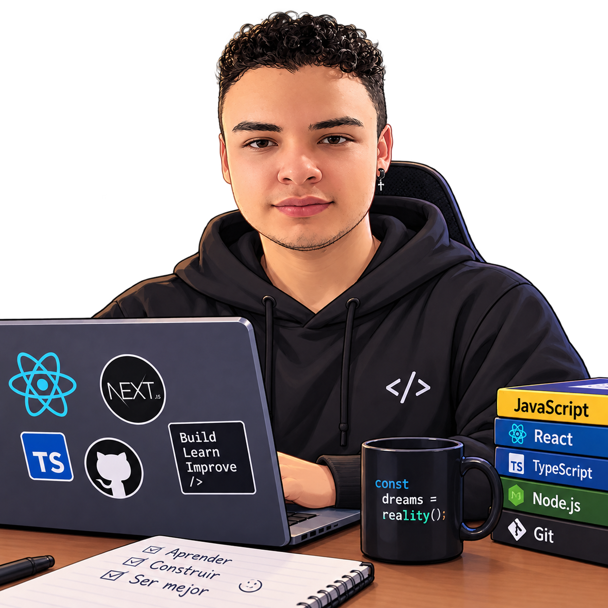

<!-- ============ BANNER ============ -->

  

<!-- ============ REDES ============ -->

  
  
  

<!-- ============ TECNOLOGÍAS ============ -->
<h2 align="center">⚙️ Technologies</h2>

  
  
  
  
  
  
   
  
  
  
  
  
   
  
  
  
  
   
  
  
  
  
  

<!-- ============ ESTADÍSTICAS ============ -->
<h2 align="center">📊 Statistics</h2>

  

 

<!-- ============ SOBRE MÍ ============ -->
<h2 align="center">👤 About Me</h2>

<!-- Sin tabla: la imagen flota a la izquierda y el texto la rodea (así no hay bordes).
     Solo se define el ancho; el alto se ajusta solo y respeta la proporción original de la foto. -->

  Hello! I'm <b>David Angel</b>, a Systems Engineer specializing in front-end development
  with <b>React.js and Next.js</b>. I build modern, responsive web applications designed
  for a great user experience, with experience in API integration, state management and
  reusable components. I also work in <b>QA test automation</b> (Playwright, Serenity/JS
  Screenplay, Karate), quality assurance and functional testing, and I'm constantly
  learning to strengthen my skills in front-end development and software quality.

 

<!-- ============ HOBBIES & GOALS ============ -->
<h2 align="center">🎯 Experience & Goals</h2>

  <b>Freelance Web Developer</b> · <i>React, Next.js, TypeScript</i> 
  Previously: Web Development Intern at MT Comunicaciones · Web Developer at Angel's Tannery
    
  Systems Engineering — Fundación Universitaria Los Libertadores 
  Learning English at Smart 🇬🇧
    
  <b>📍 Bogotá D.C., Colombia</b>

